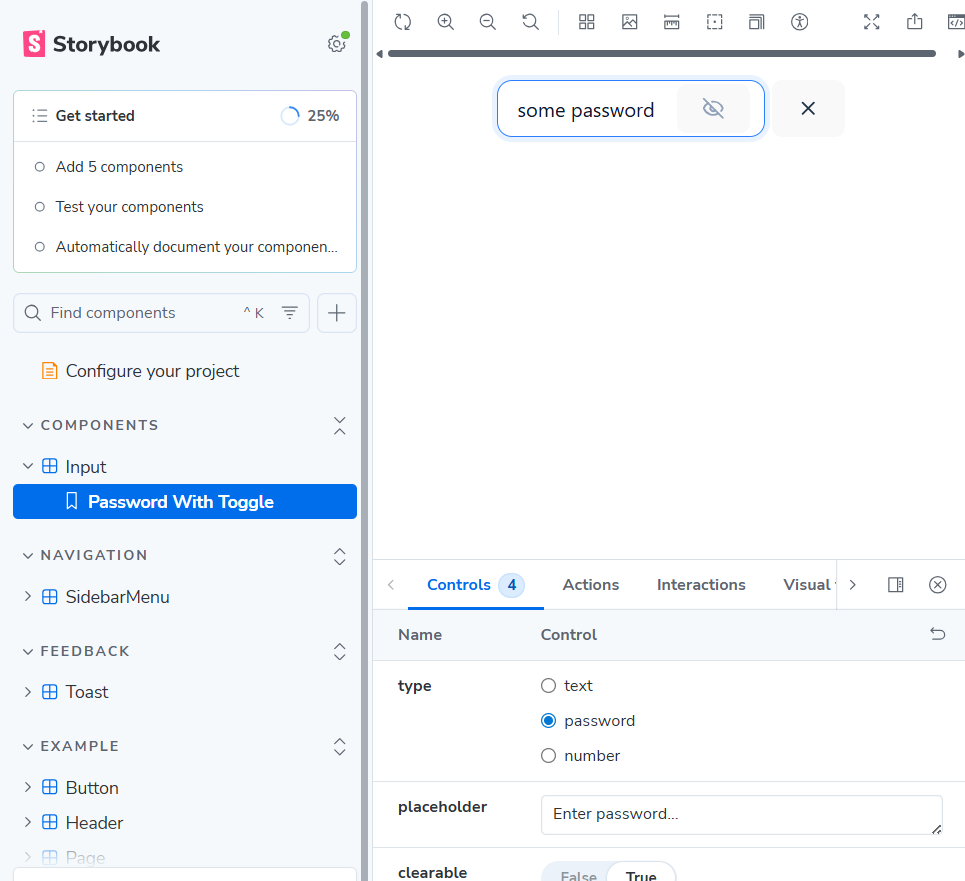
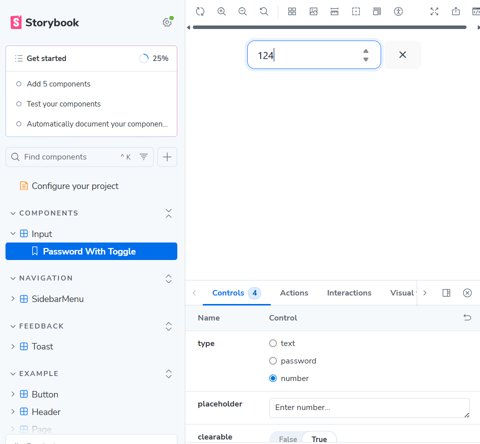
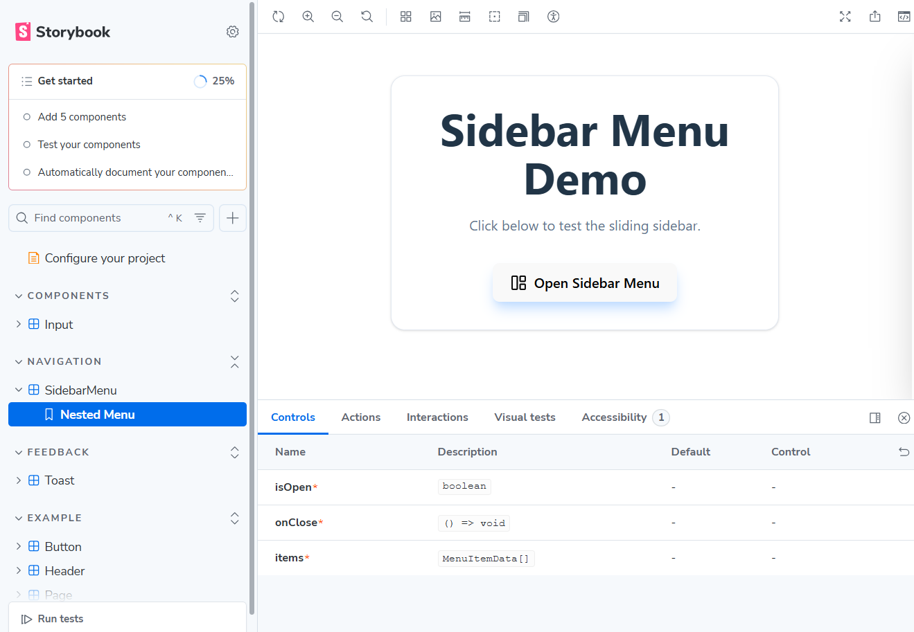
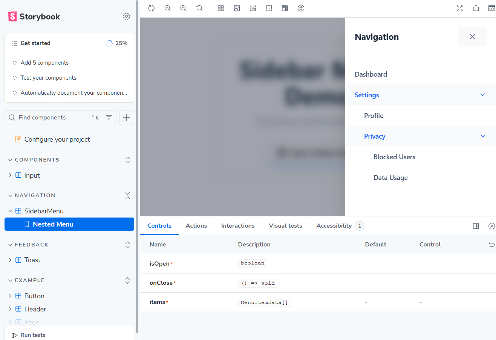
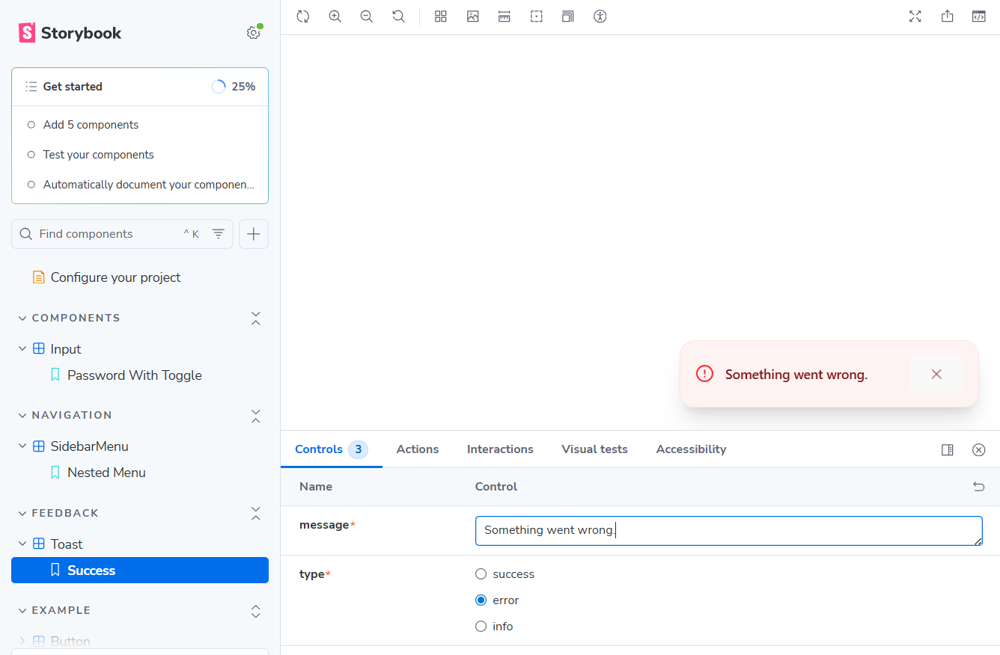
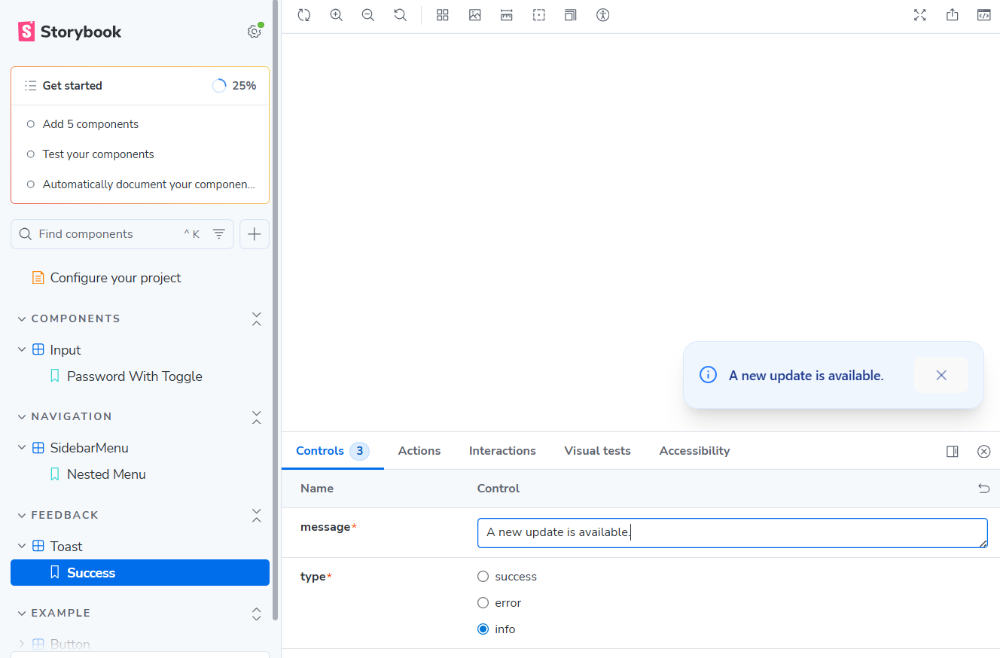

# 🚀 UI Component Library (Assessment)

A modern, high-performance UI component library built for a technical assessment. This project leverages **React 19**, **TypeScript**, **Storybook 10**, and the cutting-edge **Tailwind CSS v4** engine.

## 🛠 Tech Stack
* **Framework:** React 19
* **Styling:** Tailwind CSS v4 (Oxide engine)
* **Tooling:** Vite + TypeScript
* **Documentation:** Storybook 10
* **Icons:** Lucide React

---

## 📥 Setup & Installation

Follow these steps to run the project locally:

1.  **Clone the repository:**
    ```bash
    git clone https://github.com/IrynaShashko/storybook-component-lib
    cd storybook-component-lib
    ```

2.  **Install dependencies:**
    ```bash
    npm install
    ```

3.  **Run Storybook:**
    ```bash
    npm run storybook
    ```
    Open [http://localhost:6006](http://localhost:6006) in your browser to view the components.

---

## 🧩 Component Overview

### 1. Input Component
A versatile input field supporting multiple data types and interactive states.
* **Features:** Password visibility toggle (eye/eye-off icons), one-click clearable function, and custom label support.
* **Styling:** Utilizes Tailwind v4's dynamic focus rings and smooth transition utilities.

### 2. Sidebar Menu
An off-canvas navigation menu that slides from the right side of the screen.
* **Features:** Recursive nesting (supports unlimited menu levels), animated backdrop overlay, and click-to-close functionality.
* **Styling:** Features backdrop-blur effects and CSS-transform animations for a fluid user experience.

### 3. Toast Notification
A feedback system located at the bottom-right of the viewport.
* **Types:** `Success`, `Error`, and `Info`.
* **Behavior:** Features an auto-dismiss timer and a slide-in animation triggered upon mount.

---

## 📸 Screenshots

### **Input Component**
| Default State | Password Toggle | Clearable Input |
| :--- | :--- | :--- |
|  |  |  |

### **Sidebar Menu**
| Trigger Button | Open Menu (Nested Levels) |
| :--- | :--- |
|  |  |

### **Toast Notification**
| Success State | Error State | Info State |
| :--- | :--- | :--- |
|  |  |  |

---

## 📁 Project Structure
To maintain a clean and modern codebase, all styling logic has been migrated directly into the `.tsx` files using Tailwind utility classes. All legacy `.css` files have been removed from the component folders.

```text
src/components/
├── Input/
│   ├── Input.tsx           
│   └── Input.stories.tsx
├── SidebarMenu/
│   ├── SidebarMenu.tsx
│   └── SidebarMenu.stories.tsx
└── Toast/
    ├── Toast.tsx
    └── Toast.stories.tsx


# React + TypeScript + Vite

This template provides a minimal setup to get React working in Vite with HMR and some ESLint rules.

Currently, two official plugins are available:

- [@vitejs/plugin-react](https://github.com/vitejs/vite-plugin-react/blob/main/packages/plugin-react) uses [Babel](https://babeljs.io/) (or [oxc](https://oxc.rs) when used in [rolldown-vite](https://vite.dev/guide/rolldown)) for Fast Refresh
- [@vitejs/plugin-react-swc](https://github.com/vitejs/vite-plugin-react/blob/main/packages/plugin-react-swc) uses [SWC](https://swc.rs/) for Fast Refresh

## React Compiler

The React Compiler is not enabled on this template because of its impact on dev & build performances. To add it, see [this documentation](https://react.dev/learn/react-compiler/installation).

## Expanding the ESLint configuration

If you are developing a production application, we recommend updating the configuration to enable type-aware lint rules:

```js
export default defineConfig([
  globalIgnores(['dist']),
  {
    files: ['**/*.{ts,tsx}'],
    extends: [
      // Other configs...

      // Remove tseslint.configs.recommended and replace with this
      tseslint.configs.recommendedTypeChecked,
      // Alternatively, use this for stricter rules
      tseslint.configs.strictTypeChecked,
      // Optionally, add this for stylistic rules
      tseslint.configs.stylisticTypeChecked,

      // Other configs...
    ],
    languageOptions: {
      parserOptions: {
        project: ['./tsconfig.node.json', './tsconfig.app.json'],
        tsconfigRootDir: import.meta.dirname,
      },
      // other options...
    },
  },
])
```

You can also install [eslint-plugin-react-x](https://github.com/Rel1cx/eslint-react/tree/main/packages/plugins/eslint-plugin-react-x) and [eslint-plugin-react-dom](https://github.com/Rel1cx/eslint-react/tree/main/packages/plugins/eslint-plugin-react-dom) for React-specific lint rules:

```js
// eslint.config.js
import reactX from 'eslint-plugin-react-x'
import reactDom from 'eslint-plugin-react-dom'

export default defineConfig([
  globalIgnores(['dist']),
  {
    files: ['**/*.{ts,tsx}'],
    extends: [
      // Other configs...
      // Enable lint rules for React
      reactX.configs['recommended-typescript'],
      // Enable lint rules for React DOM
      reactDom.configs.recommended,
    ],
    languageOptions: {
      parserOptions: {
        project: ['./tsconfig.node.json', './tsconfig.app.json'],
        tsconfigRootDir: import.meta.dirname,
      },
      // other options...
    },
  },
])
```
